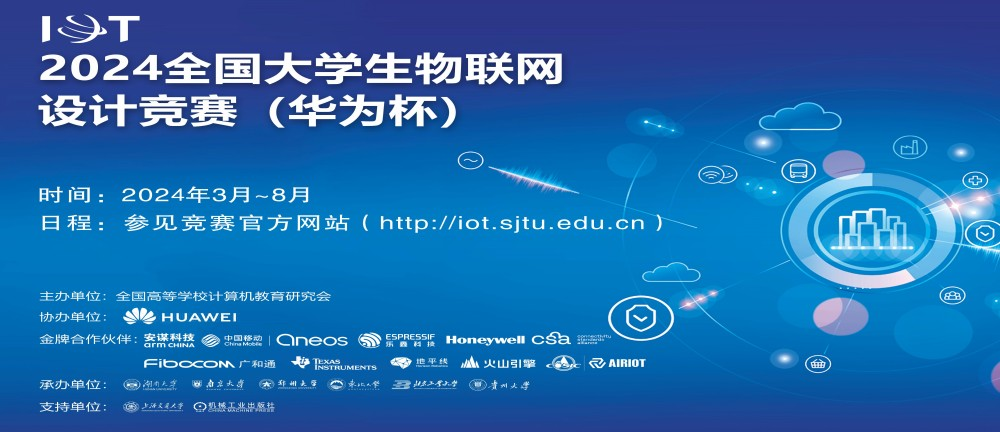

<h1 style="text-align:center;">全国大学生物联网设计竞赛</h1>

## 基本介绍
**一句话概括**

🌟 一项鼓励学生设计与实现创新物联网项目，并向评委展示其技术解决方案的比赛。

**地位**

全国大学生物联网设计竞赛是由中国高等教育学会主办，上海交通大学等知名学校承办的全国性学科竞赛，旨在推动**物联网技术创新和人才培养**。该竞赛在2023年被列入教育部竞赛认可名单，是教育部官方认可的，最具含金量、最具参赛价值的赛事之一，属于**A类**竞赛。

**趋势**

该竞赛由2014年开始举办（原名为“IT杯”，现在也叫“华为杯”），举办时间为每年的**3月份到9月份**。该竞赛影响力与含金量逐年扩大。该比赛的参赛学校、队伍数量整体上大幅提升：2023年参赛学校643所，参赛队伍1992支 -> 2024年参赛学校**835所**，参赛队伍**3294支**。越来越多的公司纷纷入局，开设赛道，在提高自身影响力的同时给予学生更多的开发平台与锻炼机会。该赛事更新迭代迅速，成长快，目前处于朝气蓬勃的状态。

**官网**

该竞赛官网信息十分完整，包含了赛题命题、比赛报名、赛事流程与获奖名单等信息，界面简单，交互方便。

竞赛官网：[全国大学生物联网设计竞赛官网(2024)](https://iot.sjtu.edu.cn/Default.aspx)

## 参赛好处
- **保研加分**：对于打算保研的同学，如果该赛事在学院中加分比较多，可以考虑参与该竞赛获得保研分
- **项目铺垫**：通过设计一个完整的项目，能同时参与大创项目于其他项目设计类的技术赛和商赛，甚至发论文，一举多得
- **丰富简历**：该竞赛属于项目设计类竞赛，参加该赛事可以在简历上增加一段完整的项目开发经历
- **实习跳板**：对于参赛表现优异或潜力大的队伍，有机会通过该竞赛获取相关企业的实习甚至是工作机会
- **项目素养**：参加该竞赛需要经历一个较为完整的项目周期，在这个过程中能大幅提高对项目的把控能力，培养项目意识
- **领导能力**：对于项目领导者，需要担当起团队核心，带领组员设计项目，此过程中能培养自身的领导力
- **视野扩展**：通过参考他人项目与自身操作，在技术和思维广度上有十分巨大的提升，这恰好是本科生的一个必备素养

## 难度分析

影响作品的名次来源于项目本身质量以及各色各样的评委，每个项目实现起来难度不同，每个评委有不同的思考切入点以及评价体系，这种随机性造成该竞赛难度**难以定量分析**。

整体而言、竞赛难度适中，以2023年为例，参赛队伍为1992支，有164支获得区域赛特等奖进入全国总决赛，进入全国赛的队伍至少有国家三等奖保底。虽然获奖概率不到百分之一，但是在庞大的参赛队伍基数下其实仍然有许多十分不完善的作品，会在早期海选中淘汰，因此总体获奖概率比较可观。

比赛难度的维度比较广，主要来自于：
- **项目创新性**：需要队伍具备一定的创新思维能力，善于收集资料与头脑风暴
- **项目功能性**：设计的项目需要具有一定的实用价值，队伍需要做足充分的调研
- **技术复杂性**：该比赛本质上还是技术赛，会考验队伍对赛题技术的运用以及项目实现难度
- **综合表现力**：考验队伍做出一个优秀项目的同时，如何通过PPT演示等表达形式将项目内容完整地传达给评委

除去老师或者历届学生的传承等先天因素，从零设计并开发一个项目的周期大概为四个月到半年不等。在比较好的项目立意、技术实现与项目表达下，是有**很大机会获奖**的。

官网上有不同区域赛与国赛的获奖名单，里面列出了获奖队伍的作品名称以及奖项，同学们可以直接查看：

[全国大学生物联网设计竞赛全国总决赛获奖名单(2023)](https://iot.sjtu.edu.cn/ueditor/net/upload/file/20230828/6382880578102673265474365.pdf)

[全国大学生物联网设计竞赛全国总决赛获奖名单(2024)](https://iot.sjtu.edu.cn/show.aspx?info_lb=34&info_id=4038&flag=2)
<!-- 此外，我们还准备了一些参赛作品的项目文档与PPT以及对应的奖项，会员们可以点击[这里](www.baidu.com)领取 -->

## 适合专业
设计一个项目可能包含了物联网、嵌入式、人工智能、通讯、前后端开发等技术栈，因此适合自动化、物联网、计算机、电信等相关工科背景的学生参加（具体有项目内容决定）

## 推荐指数
✰✰✰✰（四颗星）

**优势**：获奖难度不高、且项目产出可以继续迭代参与其他竞赛，甚至产出论文，具有丰富的延续价值，而且全程参与该比赛可以了解到十分丰富的技术栈，在工科广度与综合能力上有很大的培养

**不足**：相对于一些知名的比赛而言，影响力不足。受天时地利人和影响较大，对团队团结、项目稳定性有一定的考验，而且项目周期较长

